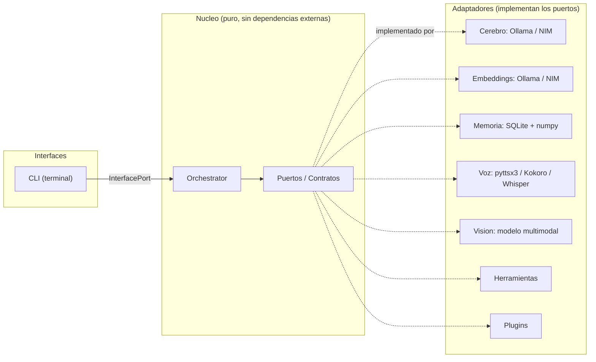

<div align="center">

# POLO

**Asistente personal con IA, modular y extensible — corre 100% local o en la nube.**

[](https://github.com/TU-USUARIO/polo/actions/workflows/ci.yml)


POLO conversa, recuerda, ve, habla, escucha y ejecuta acciones reales en tu
sistema. Su cerebro puede correr **local** (Ollama, privado y gratis) o **en la
nube** (NVIDIA NIM, rápido), intercambiable con una línea de configuración.

</div>

---

## Tabla de contenidos

- [Qué es](#qué-es)
- [Capacidades](#capacidades)
- [Arquitectura](#arquitectura)
- [Decisiones de diseño](#decisiones-de-diseño)
- [Stack técnico](#stack-técnico)
- [Instalación y uso](#instalación-y-uso)
- [Configuración](#configuración)
- [Calidad y tests](#calidad-y-tests)
- [Estructura del proyecto](#estructura-del-proyecto)

---

## Qué es

POLO es un asistente personal construido desde cero con foco en **arquitectura
limpia** y **extensibilidad**. No es un wrapper de una API: es un sistema
diseñado para que cada capacidad —el cerebro, la memoria, la voz, la visión, las
herramientas— sea una pieza intercambiable que se enchufa sin tocar el núcleo.

La diferencia entre un chatbot y un agente es que **el chatbot contesta y el
agente hace**. POLO hace: usa herramientas, controla el sistema, y recuerda
entre sesiones.

> **Local-first, con opción nube.** Por privacidad y costo cero, POLO corre
> entero en tu máquina con modelos locales. Cuando querés velocidad y más
> potencia, el mismo sistema usa modelos en la nube — sin reescribir nada.

## Capacidades

| Área | Qué hace |
|------|----------|
| 💬 **Conversación** | Diálogo natural en español, con personalidad configurable. |
| 🧠 **Memoria** | Recuerda hechos entre sesiones (base vectorial propia sobre SQLite). |
| 🧰 **Herramientas** | Hora, cálculo, clima, búsqueda web, lectura/escritura de archivos. |
| 🗣️ **Voz (salida)** | Habla sus respuestas (voz del sistema o Kokoro neuronal). |
| 🎤 **Voz (entrada)** | Te escucha por micrófono (Whisper local, detección de fin de habla). |
| 👁️ **Visión** | Analiza y describe imágenes (modelo multimodal). |
| 🖥️ **Control de PC** | Volumen, abrir apps, control de música, gestión de archivos. |
| 🧩 **Plugins** | Aprende habilidades nuevas cargando un archivo, sin tocar el núcleo. |
| ☁️ **Cerebro híbrido** | Local (Ollama) o nube (NVIDIA NIM), con respaldo automático. |

Todas las acciones con efecto (escribir/mover archivos, abrir apps) piden
**confirmación** antes de ejecutarse, y el acceso a archivos sensibles
(claves, credenciales) está bloqueado por diseño.

## Arquitectura

POLO usa **arquitectura hexagonal (puertos y adaptadores)**. El núcleo define
*contratos* (puertos) y no conoce ninguna implementación concreta. Los
adaptadores implementan esos contratos. Esto permite cambiar cualquier pieza
—modelo, motor de voz, interfaz— sin tocar la lógica central.



**Regla de oro:** el núcleo (`src/polo/core/`) no importa ninguna librería
externa ni ningún adaptador. Se verifica en cada cambio. Por eso POLO es
testeable y extensible: un adaptador nuevo (o una interfaz gráfica futura) se
enchufa sin reescribir el cerebro.

## Decisiones de diseño

Las decisiones técnicas y su porqué —lo que hace a POLO mantenible:

- **Hexagonal desde el día uno.** El desacople núcleo/adaptadores es lo que
  permite tener cerebro local *o* nube, voz simple *o* neuronal, todo por
  configuración. La complejidad se paga temprano y se cobra siempre.
- **Base vectorial propia** (SQLite + numpy, similitud coseno) en vez de una
  base vectorial pesada: cero dependencias grandes, y control total.
- **Herramientas con niveles de riesgo** (SAFE / CONFIRM): lo inofensivo corre
  solo; lo que modifica o lanza algo pide permiso. Automatización sin cheque en
  blanco (no hay ejecución de comandos arbitrarios).
- **Degradación elegante en todo:** si la nube falla, cae a local; si la voz
  neuronal falla, cae a la del sistema; si el micrófono falla, sigue por
  teclado. POLO no se rompe por una pieza.
- **Configuración fuera del código** (`.env` + pydantic-settings): los secretos
  y ajustes personales no viven en el repo.
- **Tipado estricto y tests** como red de seguridad para poder cambiar cosas sin
  miedo.

## Stack técnico

- **Lenguaje:** Python 3.12+ · gestor de dependencias [uv](https://docs.astral.sh/uv/)
- **IA local:** [Ollama](https://ollama.com) (chat, embeddings, visión)
- **IA nube (opcional):** NVIDIA NIM (compatible con OpenAI)
- **Voz:** pyttsx3 · [Kokoro](https://github.com/thewh1teagle/kokoro-onnx) (TTS neuronal) · [faster-whisper](https://github.com/SYSTRAN/faster-whisper) (STT)
- **Config:** pydantic-settings · **Logs:** structlog · **CLI:** rich
- **Calidad:** ruff (lint + formato) · mypy (tipos estrictos) · pytest · GitHub Actions

## Instalación y uso

Requisitos: Python 3.12+, [uv](https://docs.astral.sh/uv/), y
[Ollama](https://ollama.com/download) corriendo con dos modelos:

```bash
ollama pull qwen2.5:3b
ollama pull nomic-embed-text
```

Instalar y correr:

```bash
uv sync
cp .env.example .env
uv run polo
```

Extras opcionales (voz neuronal, escucha, cerebro en la nube):

```bash
uv sync --extra kokoro --extra stt --extra cloud
```

Comandos dentro de POLO: `recordá que ...`, `/memoria`, `/olvidar`,
`/herramientas`, `salir`.

## Configuración

Todo se configura por variables de entorno en `.env` (ver `.env.example`).
Algunas clave:

| Variable | Qué controla |
|----------|--------------|
| `POLO_LLM_BACKEND` | Cerebro: `ollama` (local) o `nim` (nube). |
| `POLO_EMBEDDING_BACKEND` | Embeddings: `ollama` o `nim`. |
| `POLO_VOICE_OUTPUT_ENABLED` / `POLO_VOICE_ENGINE` | Voz de salida y su motor. |
| `POLO_VOICE_INPUT_ENABLED` | Escucha por micrófono. |
| `POLO_AUTOMATION_ENABLED` | Interruptor maestro del control del sistema. |

## Calidad y tests

```bash
uv run ruff check .      # linter
uv run ruff format .     # formato
uv run mypy              # tipos estrictos
uv run pytest            # 108 tests
```

Cada push corre estos cuatro pasos automáticamente vía GitHub Actions
(`.github/workflows/ci.yml`). El núcleo se verifica "puro" (sin dependencias
externas) en cada cambio.

## Estructura del proyecto

```
src/polo/
├── core/              # Nucleo puro: sin dependencias externas
│   ├── ports/         # Contratos (LLM, memoria, voz, vision, herramientas...)
│   ├── orchestrator.py
│   ├── models.py
│   └── security.py
├── adapters/          # Implementaciones concretas de los puertos
│   ├── llm/           # Ollama · NIM · fallback
│   ├── embedding/     # Ollama · NIM
│   ├── memory/        # SQLite + numpy
│   ├── speech/        # pyttsx3 · Kokoro · Whisper
│   ├── vision/        # modelo multimodal
│   ├── tools/         # herramientas
│   └── plugins/       # cargador de plugins
├── interfaces/        # CLI (y futuras: GUI, movil...)
└── config.py          # configuracion por entorno
```

---

<div align="center">

Construido con foco en arquitectura limpia. Licencia [MIT](LICENSE).

</div>
